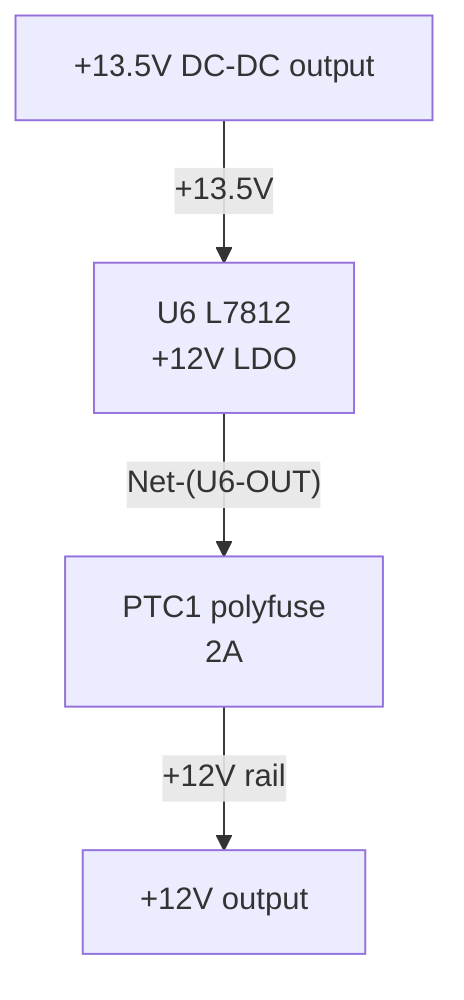

# CLAUDE.md

This file provides guidance to Claude Code (claude.ai/code) when working with code in this repository.

## Project Overview

This is a hardware project for designing a USB-PD powered modular synthesizer power supply that converts USB-C PD 15V to +12V/1.2A, -12V/0.8A, and +5V/0.5A outputs for modular synthesizers. The project uses a multi-stage design with DC-DC converters followed by linear regulators for low-noise output.

## Current Phase

**v0.4.0 (4th JLCPCB order) — ordering.** The v3 (0.3.0) board failed USB-PD negotiation
because STUSB4500 pin 18 (VBUS_VS_DISCH) was tied to GND instead of sensing VBUS. Fixed in
0.4.0: `VBUS_IN → R14 (470 Ω) → pin 18`. Schematic + PCB updated, footprint mismatch resolved.

- For the versioning scheme (X.Y.Z), see `doc/docs/inbox/versioning.md`
- For the v3 PD failure root cause + fix, see `doc/docs/inbox/v3-pd-failure-diagnosis.md`
- For the bring-up/test procedure, see `doc/docs/inbox/v3-bringup-test-procedure.md`
- For the STUSB4500 pin-by-pin guide, see `doc/docs/inbox/stusb4500-pinout.md`
- For STUSB4500 NVM programming setup, see `doc/docs/inbox/nvm-programming.md`
- For detailed current state, see `doc/docs/inbox/current-status.md`

## Versioning (X.Y.Z)

Custom scheme (not semver). Current version in the `VERSION` file at repo root.

- **X** = product release (still `0`, nothing shipped). Bump: `/l-bump-version-x` — tag + GitHub release; resets Z; **keeps Y**.
- **Y** = Nth JLCPCB PCBA order (lifetime counter). Bump: `/l-bump-version-y` — tag + GitHub release; resets Z.
- **Z** = local checkpoint tag. Bump: `/l-bump-version-z` — git tag only, no release.

Old labels map onto Y: v1→0.1.0, v2→0.2.0, v3→0.3.0, v4→**0.4.0** (current). When older docs
say "v2/v3/v4" they mean the JLCPCB order = the Y digit. Bump skills live in
`.claude/skills/l-bump-version-*`; shared logic in `.claude/scripts/bump-version.sh`. Full
details: `doc/docs/inbox/versioning.md`.

## Repository Structure

- `/doc/` - **zudo-doc documentation site** (zfb/MDX/Tailwind/Preact, deployed to Cloudflare Workers; has its own CLAUDE.md)
- `/footprints/` - **KiCad footprint library** (has its own CLAUDE.md)
- `/symbols/` - **KiCad symbol library** (`zudo-pd.kicad_sym`)
- `/diagram-sources/` - Python schemdraw scripts for circuit diagram generation
- `/3dp-files/` - 3D printable files (component guards, enclosures)
- `/jlcpcb-templates/` - JLCPCB BOM/CPL template files
- `/jlcpcb-order-snapshots/` - Historical order snapshots for reference
- `/__inbox/` - **Temporary files** (gitignored, use for working files)

### KiCad Project Files (repository root)
- `zudo-pd.kicad_pro` - Project configuration
- `zudo-pd.kicad_sch` - Root schematic (hierarchical sheet structure)
- `usb-pd-input.kicad_sch` - USB-PD input stage sub-sheet
- `dc-dc-conversion.kicad_sch` - DC-DC converters sub-sheet
- `linear-regulation.kicad_sch` - Linear regulators + protection sub-sheet
- `output.kicad_sch` - Output connectors sub-sheet
- `zudo-pd.kicad_pcb` - PCB layout file
- `fp-lib-table` / `sym-lib-table` - Library configurations

## Technical Architecture

The power supply uses a 4-stage architecture:

1. **USB-PD Stage**: STUSB4500 IC (USB-IF certified PD protocol controller) negotiates 15V from USB-C PD
2. **DC-DC Stage**: Multiple LM2596S-ADJ converters create intermediate voltages
   - +15V → +13.5V (for +12V rail)
   - +15V → +7.5V (for +5V rail)
   - +15V → -15V (LM2586SX-ADJ inverted SEPIC) → -13.5V (for -12V rail)
3. **Linear Regulator Stage**: LM78xx/LM79xx series for final low-noise outputs
   - LM7812: +13.5V → +12V
   - LM7805: +7.5V → +5V
   - LM7912: -13.5V → -12V
4. **Protection Stage**: Fuses and TVS diodes for overcurrent/overvoltage protection

## Key Design Features

- **Low-noise design**: DC-DC + Linear regulator combination for <1mVp-p ripple
- **JLCPCB compatibility**: All parts selected for JLCPCB SMT assembly
- **Safety margins**: 150%+ current capacity on all circuits
- **Modular synth optimized**: Voltage and current specifications match typical modular synthesizer requirements

## Documentation Language

**All documentation must be written in English.** This includes:
- Circuit diagrams and annotations
- Technical specifications
- README files
- Code comments
- Commit messages

Use English for all text to ensure international accessibility and collaboration. ASCII art diagrams should use English labels to avoid encoding issues.

## Schematic Documentation Conventions

When documenting circuit connectivity for AI→human handoff, use a **net-connectivity table + Mermaid block diagram** rather than ASCII-art schematics. The rationale: LLMs are unreliable at 2-D spatial layout (ASCII art), but reliable at connectivity (tabular data). Geometry-free artifacts are also regenerable from the KiCad netlist without opening the GUI.

### Net-Table Schema

One sub-table per hierarchical sheet. Column schema:

| Net | Connected pins (Ref.Pin) | Value/Note |
|-----|--------------------------|------------|

- **Net**: the KiCad net name as it appears in the netlist (e.g. `+15V`, `-13.5V`, `GND`, `Net-(U6-OUT)`).
- **Connected pins (Ref.Pin)**: space-separated list of `Ref.Pin` tokens for pins on that net that belong to the sheet being documented (e.g. `U8.VI`, `C14.1`). Cross-sheet pins may be omitted or noted as `<sheet>/Ref.Pin`.
- **Value/Note**: component value, net role, or signal description (e.g. `LDO input`, `470 µF bulk cap`, `+12V LDO output`).

Generate the table from the **KiCad netlist** (geometry-free), not by eyeballing symbol positions. Export with:

```
/Applications/KiCad/KiCad.app/Contents/MacOS/kicad-cli sch export netlist \
  --format kicadxml --output __inbox/<name>.xml zudo-pd.kicad_sch
```

Keep raw XML exports in `__inbox/` (gitignored). Only the rendered table goes in docs.

### Mermaid Block Diagram

Use a `flowchart TD` for stage-level topology — one node per functional block, edges labeled with net names or voltage levels:



This **replaces ASCII-art schematics** as the canonical AI→human connectivity handoff. ASCII art may still be used as an optional human-readable illustration, but it is not the authoritative connectivity record.

## File Types

- `.kicad_pro` - KiCad project configuration
- `.kicad_sch` - KiCad schematic files (circuit diagrams)
- `.kicad_pcb` - KiCad PCB layout files
- `.kicad_mod` - KiCad footprint files (physical component pads)
- `.kicad_sym` - KiCad symbol library files (schematic symbols)
- `fp-lib-table` / `sym-lib-table` - Library configurations
- No code compilation or testing is required - this is a hardware design project
