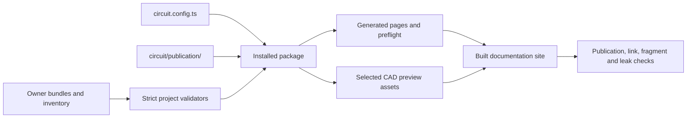

# Component evidence and documentation architecture

The component catalog is a reviewed projection of the project's structured
evidence. It does not replace the evidence, electrical review, or hardware
qualification. Root `CLAUDE.md` remains the authority for current hardware state,
measured limits and repository storage rules; `circuit/WORKFLOW.md` defines the
agent workflow.

## Ownership and data flow

The installed `@takazudo/zudo-circuit-doc` package owns generic validation,
provider adaptation, publication policy machinery, rendering, UI islands and the
CLI. Its project inputs come from root `circuit.config.ts`. This repository owns
the component evidence, the exact publication matrix and selection, CAD assets,
authored rationale, root scripts and project-specific checks.

| Path | Owner | Contract |
| --- | --- | --- |
| `.claude/skills/component-*/` | Evidence owners | Exact part facts, provenance, coverage, routing, interactions and pin maps |
| `.claude/skills/component-spec-audit/references/inventory.json` | Project | Orderable identities and placements, checked against the three board generator specs |
| `.claude/skills/component-spec-audit/references/candidates.json` | Project | Validated alternatives that are not inventory records or published parts |
| `.claude/skills/circuit-spec-integration/references/rules.json` | Project | Eleven current cross-component rules, their inputs, conditions and open evidence stages |
| `circuit.config.ts` | Project | Provider (`led-generator-v1`), Board A/B/P bindings, package paths, Python floor and preview configuration |
| `circuit/publication/` | Project | Reviewed field matrix, selected records/sources, asset allowlist, document audit and integration gloss |
| `@takazudo/zudo-circuit-doc` | Package | Generic validator, projection, renderers, islands and CLI |
| `patches/@takazudo__zudo-circuit-doc@0.1.0.patch` | Temporary component-package bridge | Reviewed compatibility until the released package supplies the same contracts |
| `patches/@takazudo__zudo-doc@5.27.0.patch` | Temporary scaffold bridge | Project heading-ID parity until the pinned scaffold release includes the reviewed behavior |
| `doc/src/content/docs/components/**` | Generator | Generated catalog, record and integration pages; never edit by hand |
| `circuit/generated/preflight.json` | Generator | Deterministic publication report; never edit by hand |
| `doc/public/assets/component-previews/**` | Generator | Selected footprint SVGs and WRL models; never edit by hand |
| `circuit/tests/` and `circuit/scripts/` | Project | Corpus, publication, host, workflow, links, model and hardware-specific checks; no alternate generator |

The evidence flow is:



The configured provider is `led-generator-v1`. It binds placement identity and
placement-level DNP state to `scripts/schgen/board_a_spec.py`,
`board_b_spec.py` and `board_p_spec.py`. The two finite value-field MPN exceptions
are `C144397` and `C591344`; the setting is in `circuit.config.ts`. The canonical
direct-routing fixture is
`.claude/skills/component-spec-audit/fixtures/direct-routing.json`.

## Published contract

Current corpus locks cover 60 inventory records, 154 selected sources, 622 facts,
175 coverage domains, 41 interactions, 60 pin maps, 196 pins and 11 integration
rules. The project validates 30 owner bundles, including 12 candidate records;
25 inventory owners are published. There are 34 package references. These counts
are review locks, not measurements or evidence of suitability.

The custom 99-field publication matrix preserves the earlier decisions and adds
only reviewed footprint/model preview publication. Eleven fields remain denied,
including raw evidence extracts, identity owner routes and binary content.
Publication selection separates 59 curated document selections from the one
honest `rec-c335982` document exception. Its distributor identity stays visible
with distributor authority; no manufacturer PDF is invented. The retained
`document-verification.json` records its dated source audit, mirrors and
referer-gated retrieval history. It is provenance, not a claim of a new live URL
check.

The package projects claims without rewriting them. A source link, generated
preview, complete evidence contract or clean site check does not establish
physical fit, measured performance, assembly state or hardware sign-off. Keep
`NEEDS BENCH`, `UNSOURCED`, `OPEN` coverage and explicit refusal reasons visible.

## Package and patch provenance

The root workspace installs `@takazudo/zudo-circuit-doc` 0.1.0 and
`@takazudo/zudo-doc` 5.27.0 from one root lockfile. Each package has its own
temporary pnpm patch in `patches/`; root and `doc/` resolve those same patched
installed modules. The circuit patch edits the shipped npm package, not a copied
source checkout; `pnpm test:compatibility` checks installed behavior and the
declaration consumer. The scaffold patch is limited to heading extraction parity
and carries its own removal tracker.

Patch groups bridge the project's existing contracts: configured board/spec
bindings and placement DNP ([circuit-doc #103](https://github.com/Takazudo/zudo-circuit-doc/issues/103)); candidate ownership and evidence partition
([#104](https://github.com/Takazudo/zudo-circuit-doc/issues/104)); independent
document, footprint and model resolution ([#105](https://github.com/Takazudo/zudo-circuit-doc/issues/105)); nullable denied owner fields and canary harvesting
([#106](https://github.com/Takazudo/zudo-circuit-doc/issues/106)); and safe
artifact scanning of published footprint hashes and generated output
([#107](https://github.com/Takazudo/zudo-circuit-doc/issues/107)). The narrow
generic asset-viewer exclusion is project host configuration, not a scanner
exception. Browser launcher scheduling and responsive reference layout remain
covered by project regressions while their upstream work proceeds
([#108](https://github.com/Takazudo/zudo-circuit-doc/issues/108),
[#109](https://github.com/Takazudo/zudo-circuit-doc/issues/109)). Dialog
accessibility follows the package's media-label contract and is checked by the
project browser smoke ([#110](https://github.com/Takazudo/zudo-circuit-doc/issues/110));
it is not a separate patch hunk. The scaffold patch aligns built heading IDs
with the reviewed native extractor behavior
([zudo-doc #4428](https://github.com/zudolab/zudo-doc/issues/4428)). The upstream
removal trackers are [zudo-pd #210](https://github.com/Takazudo/zudo-pd/issues/210)
for the circuit package patch and [zudo-pd #211](https://github.com/Takazudo/zudo-pd/issues/211)
for the scaffold patch. See [`patches/README.md`](../patches/README.md) for the
patch map.

The package's current generic view model is version 2. The renderer owns the
`zcd-*` components and stylesheet; the host registers
`circuitDocMdxExtras` in `doc/src/chrome-bindings.tsx` and imports the package
stylesheet from `doc/src/styles/global.css`. The project retains the 12-record
browser smoke because its named cases include the c335982 document gap and the
illustrative inductor model note that scaffold auto-selection cannot guarantee.

## Commands and gates

Run these from the repository root:

| Command | Purpose |
| --- | --- |
| `pnpm circuit:check` | Strict project validator and forward checks, followed by package validation |
| `pnpm circuit:generate` | Generate pages and preflight report from the installed package |
| `pnpm check` | Generated-output, preview/model parity, CAD pairs and host type checks |
| `pnpm build` | Strict project preparation, selected model publication, generation and static site build |
| `pnpm check:site` | Built-reference, publication/leak, strict link, authored-fragment and source-warning checks |
| `pnpm circuit:check-generated` | Re-run project preparation twice; catch drift, untracked output, deletion and non-idempotence |
| `pnpm test:circuit` | Project corpus, evidence, publication, workflow, link and package regressions |
| `pnpm test:compatibility` | Installed-package CLI, mutation regressions and TypeScript declaration consumer |
| `pnpm b4push` | Complete heavy local gate behind one outer `heavy-guard.sh` call |
| `pnpm test:model-viewer:browser` | Separate project browser gate over 12 representatives × two widths × two themes |

PR and production workflows install from the frozen root lock. They retain
`--intent-to-add` drift checks for generated pages, preflight and previews so
new or deleted files are visible. The second preparation proves idempotency.
Production deployment remains secret/domain guarded; the PR workflow retains its
preview alias. Local builds never deploy.

The full b4push command uses the machine-wide heavy guard once around all local
steps. Browser runs use both guards, for example:

```sh
bash "$HOME/.codex/scripts/heavy-guard.sh" -- bash "$HOME/.claude/scripts/playwright-guard.sh" --wait 300 -- pnpm test:model-viewer:browser
```

Exit 75 from the heavy guard means contention and no suite result. Read its
`verdict=` line first, retry `ENV_SUSPECT` once, and defer a persistent
environmental failure. Browser contention also exits 75 and must be retried
through the guard. Exit 4 for missing Chrome is `not run`, not a pass, and does
not satisfy mandatory browser acceptance.

## Historical path references

No active imports, production callers, CI commands or tests load code from the
retired `doc/component-docs/` directory. The remaining literal mentions are
historical or package compatibility provenance:

- `doc/src/content/docs/inbox/wave-7-3d-model-coverage.md` retains its original
  stable historical account of the model work.
- `circuit/tests/runtime.test.mjs` verifies that the installed package still
  accepts the old generated marker during safe ownership takeover.
- `circuit/tests/workflow-contract.test.ts` uses negative assertions to keep
  retired `doc/` command aliases out of the host manifest.
- `patches/README.md`, `doc/SCAFFOLD.md` and this architecture record the
  migration and imported-package provenance.

These references do not call or import the retired implementation. Keep archived
pages and their established URLs intact.
