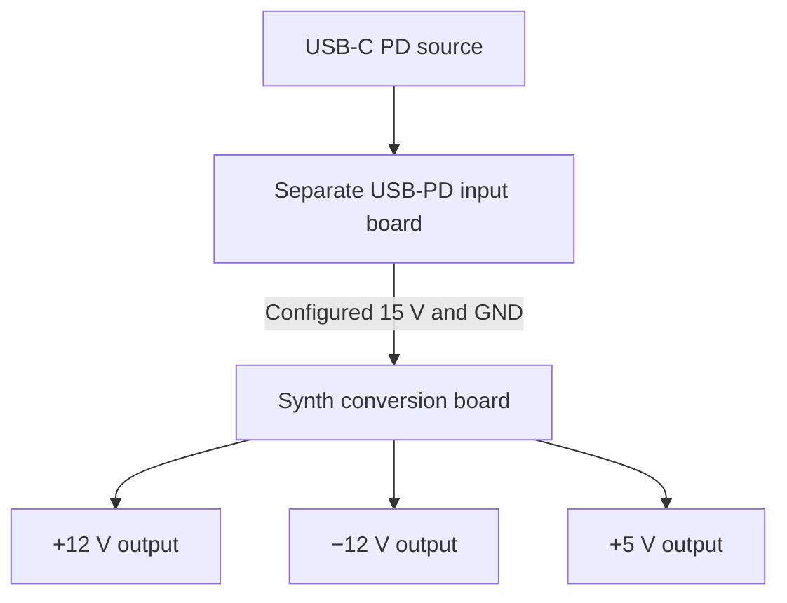

The USB-PD input module supplies switched DC power. The synth board owns conversion,
protection and output connectors.

Start with the [board contract](./board-contract.md), then the
[component map](./component-map.md) and [release readiness](./release-readiness.md).
Part facts and provenance live in the [component records](/docs/components/records/).

<CategoryNav category="architecture" />
