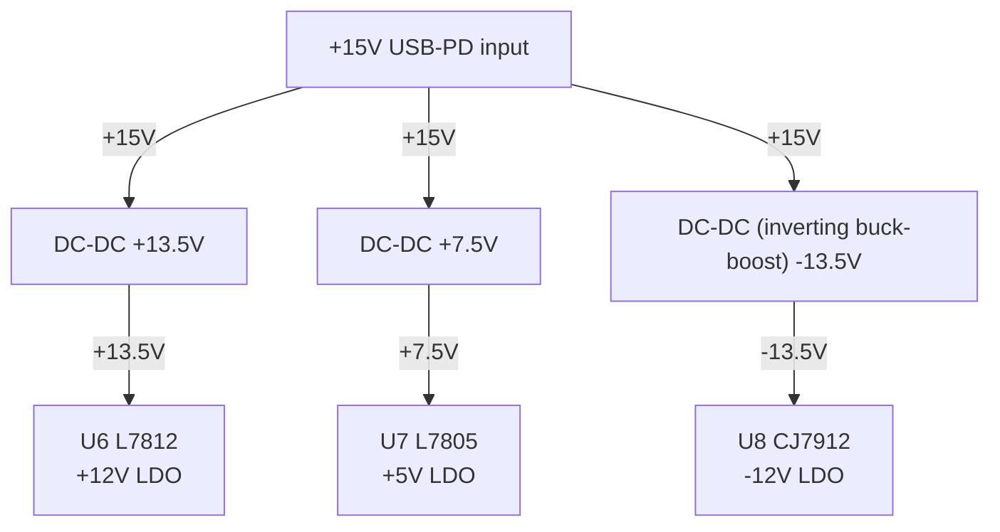
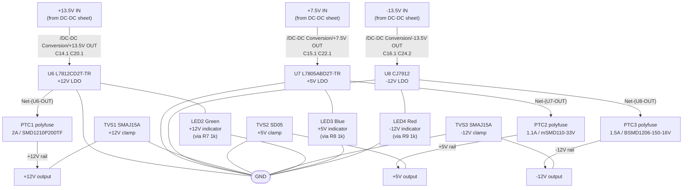

## Overview

This page explains the repo convention for documenting circuit connectivity.
The preferred AI→human handoff artifact is a **net-connectivity table** (derived
from the KiCad netlist) paired with a **Mermaid block diagram** for stage-level
topology.

**Why not ASCII art?** LLMs are unreliable at 2-D spatial layout — a slight
misalignment makes a diagram misleading. Net tables are geometry-free (no 2-D
representation), generated from the authoritative netlist, and trivially
verifiable. Mermaid renders as a proper block diagram in the doc site. ASCII art
may still be used as an optional human-readable illustration, but it is not the
authoritative connectivity record.

## Net-Table Schema

One sub-table per hierarchical sheet. The three columns are:

| Net | Connected pins (Ref.Pin) | Value/Note |
|-----|--------------------------|------------|

- **Net** — the KiCad net name exactly as it appears in the exported netlist
  (e.g. `+15V`, `-13.5V`, `GND`, `Net-(U6-OUT)`). Cross-sheet nets keep their
  full path prefix (e.g. `/DC-DC Conversion/+13.5V OUT`).
- **Connected pins (Ref.Pin)** — space-separated list of `Ref.Pin` tokens for
  all pins on that net that belong to the sheet being documented (e.g.
  `U8.2 C16.1 C24.2`). Pins from other sheets may be omitted or listed as
  `<sheet>/Ref.Pin`.
- **Value/Note** — component value, net role, or signal description (e.g.
  `LDO input rail`, `470 µF bulk cap`, `+12V LDO output before polyfuse`).

## Generating the Table from the KiCad Netlist

Always derive the table from the **KiCad netlist** — never by eyeballing symbol
positions in the GUI. Export with:

```sh
/Applications/KiCad/KiCad.app/Contents/MacOS/kicad-cli sch export netlist \
  --format kicadxml \
  --output __inbox/<sheet-name>-netlist.xml \
  zudo-pd.kicad_sch
```

The root schematic `zudo-pd.kicad_sch` contains all hierarchical sheets; one
export covers everything. Keep the raw XML in `__inbox/` (gitignored). Parse it
with Python's `xml.etree.ElementTree` — every `<net>` element lists `<node
ref="..." pin="..." />` children that map directly to the `Ref.Pin` column.

## Mermaid Block Diagram

Pair every net table with a `flowchart TD` that shows the stage-level signal
flow. Use one node per functional block; label edges with net names or voltage
levels:



Keep the diagram at the **block level** — one node per functional stage, not
one node per component. Component-level detail lives in the net table.

## Worked Example: Linear Regulation Sheet

The linear-regulation sheet (`linear-regulation.kicad_sch`) contains three LDO
stages (U8 CJ7912 −12V, U7 L7805 +5V, U6 L7812 +12V) plus their bypass
capacitors, indicator LEDs, polyfuse protection (PTC1–3), and TVS clamping
diodes (TVS1–3).

The following table and diagram were derived from the KiCad netlist exported on
2026-06-17 using `kicad-cli sch export netlist`.

### Block Diagram



### Net Table — Linear Regulation Sheet

| Net | Connected pins (Ref.Pin) | Value/Note |
|-----|--------------------------|------------|
| `/DC-DC Conversion/+13.5V OUT` | `U6.1 C14.1 C20.1` | LDO input for +12V rail; `U6.1` = IN pin; `C14.1`/`C20.1` = 470 µF input bulk caps |
| `/DC-DC Conversion/+7.5V OUT` | `U7.1 C15.1 C22.1` | LDO input for +5V rail; `U7.1` = IN pin; `C15.1` = 470 nF, `C22.1` = 470 µF |
| `/DC-DC Conversion/-13.5V OUT` | `U8.2 C16.1 C24.2` | LDO input for -12V rail; `U8.2` = VIN pin; `C16.1` = 470 nF, `C24.2` = 470 µF |
| `Net-(U6-OUT)` | `U6.3 C17.2 C21.1 PTC1.1 R7.1` | +12V LDO output before polyfuse; `C17.2` = 100 nF output bypass, `C21.1` = 470 µF, `R7.1` = LED resistor |
| `Net-(U7-OUT)` | `U7.3 C18.1 C23.1 PTC2.1 R8.1` | +5V LDO output before polyfuse; `C18.1` = 100 nF output bypass, `C23.1` = 470 µF |
| `Net-(U8-OUT)` | `U8.3 C19.1 C25.2 PTC3.1 R9.1` | -12V LDO output before polyfuse; `C19.1` = 100 nF output bypass, `C25.2` = 470 µF |
| `Net-(C16-Pad2)` | `C16.2 C19.2 C24.1 C25.1` | Negative rail filter node between input and output caps of the -12V path |
| `+12V rail` | `PTC1.2 TVS1.1` | Protected +12V output; `PTC1.2` = polyfuse output, `TVS1.1` = TVS cathode clamp |
| `+5V rail` | `PTC2.2 TVS2.2` | Protected +5V output; `PTC2.2` = polyfuse output, `TVS2.2` = TVS cathode |
| `-12V rail` | `PTC3.2 TVS3.2` | Protected -12V output; `PTC3.2` = polyfuse output, `TVS3.2` = TVS anode (negative rail) |
| `Net-(LED2-A)` | `LED2.2 R7.2` | +12V indicator LED anode node; `R7.2` = resistor output, `LED2.2` = LED anode |
| `Net-(LED3-A)` | `LED3.2 R8.2` | +5V indicator LED anode node |
| `Net-(LED4-C)` | `LED4.1 R9.2` | -12V indicator LED cathode node (negative rail side) |
| `GND` | `U6.4 U7.2 U8.1 C14.2 C15.2 C17.1 C18.2 C20.2 C21.2 C22.2 C23.2 LED2.1 LED3.1 LED4.2 TVS1.2 TVS2.1 TVS3.1` | Common ground; LDO GND pins, all bulk/bypass cap negatives, LED cathodes/anodes, TVS return pins |

<Note>
Pin numbers follow the KiCad netlist — they match the symbol pin numbers in the
schematic, not necessarily the physical package pin numbers. For example, `U6.1`
is KiCad pin 1 of U6 (L7812, TO-263-2 package), which is the IN pin.
</Note>

## Reference

- Root `CLAUDE.md` § Schematic Documentation Conventions — the convention spec.
- `doc/CLAUDE.md` § Circuit Diagram Writing Rules — authoring guidance for docs.
- `__inbox/lin-reg-netlist.xml` — the raw KiCad XML netlist used to generate the
  table above (gitignored; regenerate with the `kicad-cli` command above).
