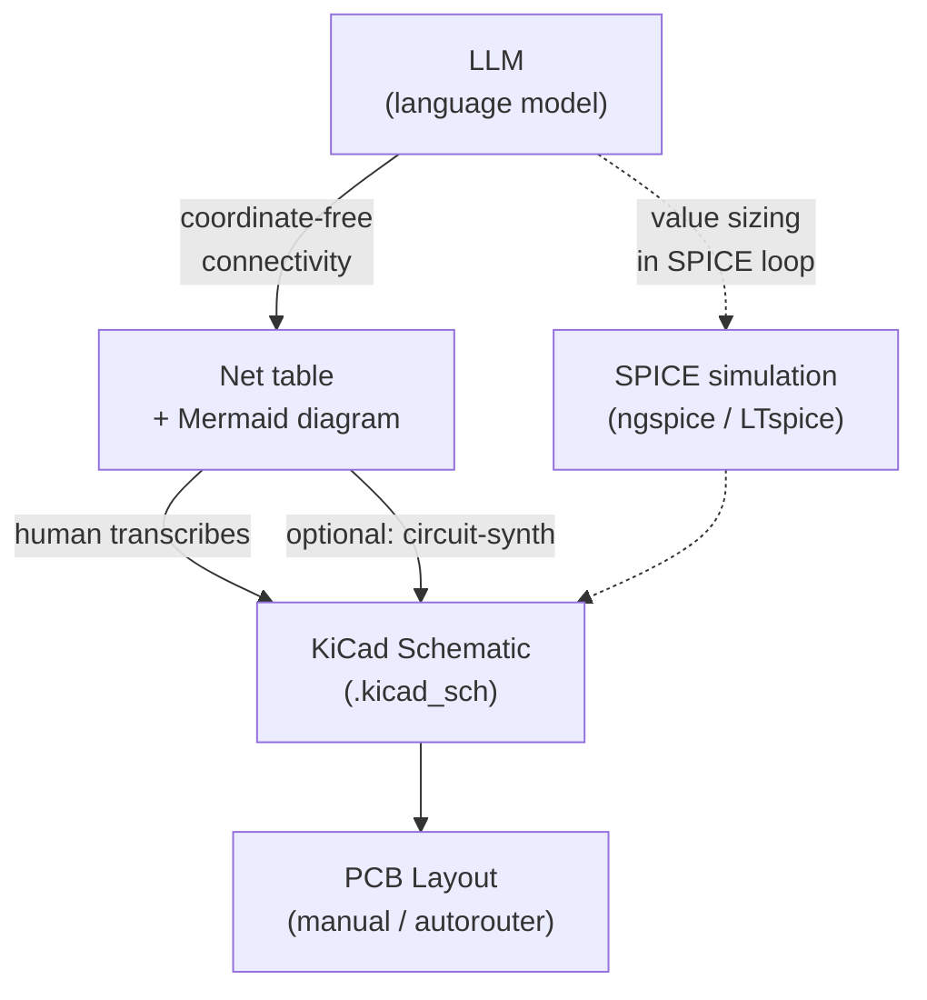

Research for a solo hobbyist building a USB-PD modular-synth power supply in KiCad, driven by an LLM coding agent (Claude Code). Three approaches were already tried and rejected: letting the AI write `.kicad_sch` directly, schemdraw, and improving ASCII-art schematics. This page documents why those failed and what the field actually does instead.

## The Core Finding: LLMs Can't Do 2-D, So Stop Asking Them to Draw

All three rejected approaches failed for the **same root cause**, unfixable by better prompting: **LLMs cannot reliably encode geometry.** Tokenization flattens 2-D into 1-D and self-attention has no native 2-D inductive bias. The literature measures a **13–27 point gap** between an LLM's ability to *read* a spatial layout vs. *produce* one.

- **ASCII art** is unattainable by construction (a generation problem, not a prompt problem).
- **Raw `.kicad_sch`** is the *worst* possible target — explicit x/y/rotation, inverted Y-axis, 1.27 mm grid. The 2026 HWE-Bench benchmark for exactly this goal (spec → board schematic) has the **top model passing only 8.15%**.
- **schemdraw** is still a drawing API, so the layout burden stays on the human/model.

KiCad's lead developer Seth Hillbrand called natural-language circuit generation *"one of the least helpful applications for LLMs out there."* The whole field has converged on one architecture: **the LLM emits coordinate-free connectivity; a deterministic engine (or the human, in KiCad) does the placement.**

The real handoff is not "AI draws a schematic" — it is **"AI emits a structured, checkable connectivity artifact; you render it."**

*The LLM's job is to emit connectivity; geometry is always the deterministic engine's (or the human's) job.*

## Family 1 — AI Drives KiCad Directly (MCP / IPC / In-Editor Plugins): Dead End for Generation

- The official KiCad **9 and 10** API is **PCB-only**; KiCad 10 shipped (April 2026) still without an Eeschema (schematic) API. No sanctioned way to author a `.kicad_sch`.
- `kicad-sch-api` is the one library that can create wires/symbols from scratch, but its own issues admit "LLMs struggle with inverted Y-axis" and placement is "unreliable." An independent test called a Claude-generated KiCad schematic *"penguin on a bicycle level."*
- In-editor chat plugins exist (ALT TAB Circuit Copilot; KiC-AI with local Ollama; a community KiCad AI Assistant) — but they are Q&A/assist, not reliable generators.

**Useful subset:** read-only MCP servers for *interrogating* a design; `kicad-sch-api` for *scripted edits to schematics you already drew* (bulk rename, stamp a repeated block).

## Family 2 — Code-Defined Hardware That Exports to KiCad: Contains the Best Candidate

- **circuit-synth** (top pick) — Python (`@circuit`, `net += pin`) → a **real hierarchical `.kicad_sch` + `.kicad_pcb` + netlist, then stops before layout.** Mirrors the AI→schematic→manual-PCB split exactly; bidirectional, JLCPCB-aware, ships Claude Code slash-commands. Caveat: auto-*placement* is the weak link (topologically correct, not pretty); its ERC is incomplete and would not have caught the v3 STUSB4500 pin-18 bug.
- **SKiDL** — mature Python→netlist+ERC; its author says skip its schematic gen and go netlist→PCB. Best use: an ERC oracle for the repeated 78xx/79xx LDO stages.
- **atopile** — most mature, but produces **no readable schematic** (netlist/ratsnest only) — bypasses the step we care about.
- **Diode `pcb`/Zener** — best *verification* story (compiler + TestBench + SPICE, Anthropic-partnered) but exports `.kicad_pcb`, not `.kicad_sch`.
- **tscircuit** — architecturally right but React/TS stack mismatch.

## Family 3 — Better Text Representations + the Netlist Handoff: Lowest-Effort, Highest-ROI

<Note>
Hard fact: **KiCad has no netlist→schematic import.** A netlist gives a PCB ratsnest, not a drawn schematic. Auto-placement, not connectivity, is the unsolved part.
</Note>

**The winner: a net table + a Mermaid block diagram.** Drop ASCII *art*, keep a `| Net | Connected pins (Ref.Pin) | Value/Note |` table (one per sheet) plus a Mermaid `flowchart TD` for topology. Pure connectivity = zero geometry to get wrong = the LLM's most reliable output.

The repo's own `v3-pd-failure-diagnosis.md` proved this: a multi-agent pass produced false findings by *guessing pin numbers from screen position*, while the connectivity table made the analysis verifiable.

Optional docs upgrade: **lcapy** (1-D netlist + one direction word per part → clean rendered figure, guaranteed correct-to-netlist) — better than ASCII/schemdraw for figures, but needs a LaTeX toolchain and has no KiCad path.

## Family 4 — Commercial AI EDA: Mostly Not Composable with a Terminal Agent

Flux Copilot / Circuit Mind / CELUS are walled-garden chat UIs (replace the agent, don't compose). The AI autorouters (Quilter, DeepPCB) target the layout stage done by hand.

Worth adopting regardless: **Octopart** (free KiCad parts + queryable API) and **SnapMagic** (free native-KiCad footprint/symbol generation).

## Family 5 — Academic State of the Art: Steal the Patterns, Not the Tools

- A paper on **switched-mode power supply design with LLMs** (the exact domain): value/parameter tuning went **14% (GPT-4o alone) → 85% (o3 + SPICE) → 91% (o3 + RAG + SPICE)**, but topology adaptation stays ~50%. Lesson: **let the LLM size values for a topology *you* choose, in a SPICE loop; don't let it invent topology.**
- "Understanding" is now strong (96%+ netlist-from-schematic-image, even hand-drawn) → **sketch → digitize is a more reliable bet than generate-from-scratch.**
- EEschematic (MIT) is a runnable implementation of the "generate → render → critique" visual-chain-of-thought loop.

## Comparison of Top Candidates

| Tool | What it does | LLM-friendly? | KiCad path | Fit |
|---|---|---|---|---|
| Net table + Mermaid | LLM emits connectivity + block diagram; you transcribe | High (no geometry) | Manual (the hinge to any generator) | #1 — adopt now, zero setup |
| circuit-synth | Python → real hierarchical `.kicad_sch`, stops before layout | High | Native `.kicad_sch` (best of any tool) | #2 — spike one sub-sheet |
| SKiDL | Python → netlist + ERC | High | Netlist→PCB only | #3 — ERC oracle for repeated stages |
| lcapy | 1-D netlist + direction hints → clean figure | Med-High | None (docs figures) | Docs-diagram upgrade |
| kicad-sch-api | Round-trip-safe `.kicad_sch` read/write | Med | Native | Scripted edits only, not from-scratch |
| Diode/Zener | Code + TestBench + SPICE | High | `.kicad_pcb` only | Verification experiment only |
| atopile | `.ato` → netlist/ratsnest | Med-High | No schematic | Poor fit (bypasses step 5→6) |

## Recommendations (A–D)

### A — Adopt Now (Zero Setup): Net Table + Mermaid, Replacing ASCII Art

Per circuit, emit a Mermaid `flowchart TD` (topology) + a markdown net table (one per hierarchical sheet). Bake the convention into CLAUDE.md. Transcribe into KiCad from a diffable, reviewable, geometry-free artifact. **Highest-ROI change.**

### B — One-Hour Spike: circuit-synth on the Linear-Regulation Sheet

Write it as circuit-synth Python, generate the `.kicad_sch`, and time placement tidy-up vs. hand-drawing ~27 parts. Keep it for well-understood sheets if it wins.

### C — Standing Safety Net: a Datasheet-Aware Review Pass Before Every JLCPCB Order

Export the schematic to compact text, feed it + datasheets to the LLM with a power-supply checklist (VBUS sense paths, EN/feedback dividers, dropout headroom, polarity, abs-max). A datasheet-aware pass plausibly *would* have caught "pin 18 → R14 → GND instead of sensing VBUS." Reviewer beats generator.

### D — High-Leverage: a SPICE Loop for Value-Sizing

The academic 14%→90% lever, runnable today in ngspice/LTspice, independent of any KiCad tool. For a noise-sensitive multi-rail supply this is arguably more valuable than circuit-synth.

<Note>
**Keep doing manually:** drawing the schematic + tweaking the PCB by hand, and choosing the topology. That is the correct 2026 division of labor, not a limitation.

**Bottom line:** the three rejections were all correct — only the *direct-generation corner* is a dead end. The realistic win is "AI produces a verifiable, geometry-free draft and reviews your work," not "AI replaces KiCad."
</Note>

## Corrections and Caveats

- The 13–27 point read-vs-generate gap is from the Schemato paper (arXiv 2411.13899); the HWE-Bench 8.15% figure is from arXiv 2603.18102. Both measure a specific task difficulty, not a permanent ceiling — models will improve.
- circuit-synth's auto-placement produces topologically correct schematics but the visual result usually needs manual tidying. Time savings depend heavily on circuit complexity.
- The SMPS-with-LLMs paper (arXiv 2507.10639) measured value-sizing accuracy on a specific benchmark; real-world SMPS design involves additional constraints not captured in the benchmark.
- lcapy requires a working LaTeX toolchain (TeX Live or MiKTeX) — non-trivial on some platforms.
- `kicad-sch-api` is the only library that can round-trip `.kicad_sch` files reliably; it is maintained by the circuit-synth team.

## Sources

- **HWE-Bench** (spec→schematic, 8.15% pass rate): arXiv 2603.18102
- **CircuitLM** (ERC-clean vs. functionally-correct; fails analog/power): arXiv 2601.04505
- **Schemato** (position coords problematic; netlists carry no geometry): arXiv 2411.13899
- **SMPS-with-LLMs** (14%→91% with SPICE+RAG): arXiv 2507.10639
- **AnalogCoder / AnalogCoder-Pro** (simulator-in-the-loop): arXiv 2508.02518
- **SINA / Masala-CHAI** (schematic-image → netlist, incl. hand-drawn): arXiv 2601.22114, arXiv 2411.14299
- **EEschematic** (runnable VCoT loop, MIT): github.com/eelab-dev/EEschematic
- **Hillbrand quote** (KiCad devlist): groups.google.com/a/kicad.org/g/devlist/c/4hjJIFbBtXU
- **circuit-synth**: github.com/circuit-synth/circuit-synth
- **kicad-sch-api**: github.com/circuit-synth/kicad-sch-api
- **SKiDL**: github.com/devbisme/skidl
- **atopile**: github.com/atopile/atopile
- **Diode pcb**: github.com/diodeinc/pcb
- **tscircuit**: github.com/tscircuit/tscircuit
- **lcapy**: lcapy.readthedocs.io
- **Octopart**: altium.com/octopart
- **SnapMagic**: snapeda.com
