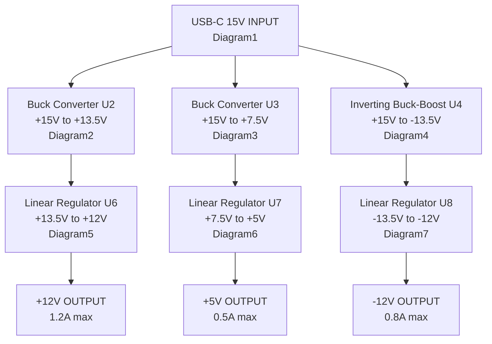

Complete circuit configuration shown in stages.

## Power Flow Overview

This diagram shows the complete power conversion chain from USB-C input to all output rails, including the relationship between all circuit diagrams.



**Power Conversion Strategy:**

- **Two-stage design**: DC-DC converters provide efficient voltage reduction, linear regulators provide low-noise final outputs
- **+12V rail**: USB-C 15V → Buck (U2) → LDO (U6) → +12V OUT
- **+5V rail**: USB-C 15V → Buck (U3) → LDO (U7) → +5V OUT
- **-12V rail**: USB-C 15V → Inverting Buck-Boost (U4) → LDO (U8) → -12V OUT

---

## Diagram1: USB-PD Power Supply Section (STUSB4500)

:::info v1.1 Upgrade
This section documents the **STUSB4500-based** design (v1.1). The STUSB4500 is USB-IF certified with ~95%+ charger compatibility. For the deprecated CH224D design (v1.0), see [CH224D documentation](../components/ch224d.md).
:::

### Diagram1-1: Complete STUSB4500 Circuit with Load Switch

```
                           VBUS_IN (from USB-C J1)
                                    │
    ┌───────────────────────────────┼───────────────────────────────────┐
    │                               │                                   │
    │                          R11 (100kΩ)                              │
    │                               │                                   │
    │                               ├──────── Q1 (AO3401A) ─────────────┤
    │                               │          S ←───── D               │
    │                          R12 (56kΩ)          │                    │
    │                               │              G                    │
    │                               │              │                    │
    │   STUSB4500 (QFN-24)          │              │                    │
    │   ┌────────────────────┐      │              │                    │
    │   │                    │      │              │                    │
    │   │  VBUS_EN_SNK ──────┼──────┘              │                    │
    │   │  (pin 16)          │                     │                    │
    │   │                    │                    C35 (100nF)           │
    │   │  VDD (pin 24) ─────┼── VBUS_IN           │                    │
    │   │        │           │                    GND                   │
    │   │       C2 (100nF)   │                                          │
    │   │        │           │                     ▼                    │
    │   │       GND          │                 VBUS_OUT ──→ (to DC-DC)  │
    │   │                    │                     │                    │
    │   │  VREG_2V7 (pin 23) │                    TP1                   │
    │   │        │           │                                          │
    │   │       C30 (1µF)    │                                          │
    │   │        │           │                                          │
    │   │       GND          │                                          │
    │   │                    │                                          │
    │   │  VREG_1V2 (pin 21) │                                          │
    │   │        │           │                                          │
    │   │       C34 (1µF)    │                                          │
    │   │        │           │                                          │
    │   │       GND          │                                          │
    │   │                    │                                          │
    │   │  VSYS (pin 22) ────┼── GND (not used)                         │
    │   │                    │                                          │
    │   │  RESET (pin 6) ────┼── GND (internal pull-down, NC also OK)   │
    │   │                    │                                          │
    │   │  DISCH (pin 9) ────┼── R13 (470Ω) ── VBUS_OUT                 │
    │   │                    │                                          │
    │   │  VBUS_VS_DISCH ────┼── R14 (470Ω) ── VBUS_IN                │
    │   │  (pin 18)          │                                          │
    │   │                    │                                          │
    │   │  ADDR0 (pin 12) ───┼── GND                                    │
    │   │  ADDR1 (pin 13) ───┼── GND                                    │
    │   │                    │                                          │
    │   │  GND (pin 10)      │                                          │
    │   │  EP (pin 25) ──────┼── GND                                    │
    │   │                    │                                          │
    │   │  CC1 (pin 2) ──────┼────┬── USB-C CC1                         │
    │   │  CC1DB (pin 1) ────┼────┘                                     │
    │   │                    │    │                                     │
    │   │  CC2 (pin 4) ──────┼────┼─┬── USB-C CC2                       │
    │   │  CC2DB (pin 5) ────┼────┼─┘                                   │
    │   │                    │    │                                     │
    │   └────────────────────┘    │                                     │
    │                             │                                     │
    │   ESD Protection D4 (USBLC6-2SC6):                                 │
    │   ┌──────────────────────┐                                        │
    │   │ Pin 1 (I/O1) ────────┼─ USB-C CC1 ─→ Pin 6 (I/O1) ─→ CC1     │
    │   │ Pin 3 (I/O2) ────────┼─ USB-C CC2 ─→ Pin 4 (I/O2) ─→ CC2     │
    │   │ Pin 2 (GND)  ────────┼─ GND                                   │
    │   │ Pin 5 (VBUS) ────────┼─ VBUS_IN                               │
    │   └──────────────────────┘                                        │
    │                                                                   │
    └───────────────────────────────────────────────────────────────────┘
                                    │
                                   GND

USB-C Connector J1 (6-pin power-only):
┌─────────────────────────────────────┐
│  A9,B9  VBUS  ──────────────────────┼──→ VBUS_IN Rail (5V initially)
│                                     │
│  A5     CC1   ──────────────────────┼──→ To STUSB4500 CC1 (pin 2)
│  B5     CC2   ──────────────────────┼──→ To STUSB4500 CC2 (pin 4)
│                                     │
│  A1,B12 GND   ──────────────────────┼──→ System GND
└─────────────────────────────────────┘
```

### Diagram1-2: Load Switch Operation (Power Path Control)

```
Power Path with P-Channel MOSFET Load Switch:

                    VBUS_IN (15V after PD negotiation)
                           │
                      R11 (100kΩ)  ← Gate pull-up (default OFF)
                           │
VBUS_EN_SNK ───┬── R12 (56kΩ) ──┴─── Gate ─── Q1 (AO3401A)
(from STUSB4500)│                              │    │
               │                            Source Drain
              C35 (100nF)                      │    │
               │                           VBUS_IN  │
              GND                                   ▼
                                              VBUS_OUT (to DC-DC)

Load Switch Operation:
┌────────────────────────────────────────────────────────────────────┐
│ State              │ VBUS_EN_SNK │ Gate Voltage │ Q1 State │ Output│
├────────────────────┼─────────────┼──────────────┼──────────┼───────┤
│ No cable / PD fail │ LOW (0V)    │ HIGH (VBUS)  │ OFF      │ 0V    │
│ PD negotiation OK  │ HIGH (~3V)  │ LOW (~2V)    │ ON       │ 15V   │
└────────────────────────────────────────────────────────────────────┘

Why P-Channel MOSFET?
- Simple high-side switch (no charge pump needed)
- Gate referenced to VBUS (easy to drive with VBUS_EN_SNK)
- Default OFF when gate is pulled to VBUS via R11

Soft-Start Calculation:
- Time constant: τ = R12 × C35 = 56kΩ × 100nF = 5.6ms
- Limits dV/dt during turn-on, reducing inrush current
```

### Diagram1-3: USB PD Negotiation Process (STUSB4500)

```
Step-by-step PD negotiation sequence:

1. Initial Connection (0-100ms):
   ┌─────────┐                    ┌───────────┐
   │ USB-C   │ ─── VBUS (5V) ───→ │ STUSB4500 │──→ Q1 OFF (no output)
   │ PD      │                    │           │
   │ Adapter │ ← CC1/CC2 pins  ─→ │ (handles  │
   └─────────┘                    │  Rd int.) │
                                  └───────────┘
   VBUS = 5V (default USB voltage)
   STUSB4500 presents Rd internally (no external 5.1kΩ needed)
   VBUS_EN_SNK = LOW → Q1 OFF → VBUS_OUT = 0V

2. Capability Discovery (100-200ms):
   STUSB4500 requests Source Capabilities via CC
   PD Adapter responds: 5V, 9V, 12V, 15V, 20V profiles

3. Voltage Request (200-300ms):
   STUSB4500 requests 15V (from NVM configuration)
   Built-in retry on failure (unlike CH224D)

4. Acceptance & Voltage Transition (300-500ms):
   PD Adapter accepts request
   VBUS transitions: 5V → 15V
   STUSB4500 waits for stable VBUS

5. Power Ready (>500ms):
   STUSB4500 confirms 15V stable
   VBUS_EN_SNK goes HIGH → Q1 turns ON
   VBUS_OUT = 15V (power delivered to DC-DC stages)

KEY DIFFERENCE from CH224D:
- Q1 prevents power delivery until PD negotiation succeeds
- No 5V exposure to downstream circuits
- Clean startup without voltage transitions on output
```

### Diagram1-4: STUSB4500 Pin Configuration

```
STUSB4500 (QFN-24) - USB-IF Certified PD Sink Controller:

              ┌───────────────────────────────────────┐
              │              (Top View)               │
              │                                       │
    CC1DB   1 │●                                   24│ VDD ─── VBUS_IN + C2 (100nF)
      CC1   2 │                                   23│ VREG_2V7 ── C30 (1µF) ── GND
       NC   3 │                                   22│ VSYS ── GND
      CC2   4 │                                   21│ VREG_1V2 ── C34 (1µF) ── GND
    CC2DB   5 │                                   20│ POWER_OK2 (NC)
    RESET   6 │── GND (or NC)                    19│ ALERT (NC)
      SCL   7 │── NC (or I2C)                     18│ VBUS_VS_DISCH ── R14 (470Ω) ── VBUS_IN
      SDA   8 │── NC (or I2C)                     17│ A_B_SIDE (NC)
    DISCH   9 │── R13 (470Ω) ── VBUS_OUT          16│ VBUS_EN_SNK ──→ Gate drive
      GND  10 │── GND                             15│ GPIO (NC)
   ATTACH  11 │── NC                              14│ POWER_OK3 (NC)
    ADDR0  12 │── GND                             13│ ADDR1 ── GND
              │                                       │
              │         ┌──────────────┐              │
              └─────────┤  EP (pin 25) ├──────────────┘
                        │     GND      │
                        └──────────────┘

Critical Pin Connections:
┌──────────────┬──────────────────────────────────────────────────────┐
│ Pin          │ Connection                                           │
├──────────────┼──────────────────────────────────────────────────────┤
│ VDD (24)     │ VBUS_IN + C2 (100nF) to GND                          │
│ CC1 (2)      │ USB-C CC1, also to CC1DB (pin 1)                     │
│ CC2 (4)      │ USB-C CC2, also to CC2DB (pin 5)                     │
│ CC1DB (1)    │ Tie to CC1 (enables dead battery mode)               │
│ CC2DB (5)    │ Tie to CC2 (enables dead battery mode)               │
│ VBUS_EN_SNK (16) │ To gate drive (R12) → Q1 gate                    │
│ VREG_2V7 (23)│ C30 (1µF) to GND                                     │
│ VREG_1V2 (21)│ C34 (1µF) to GND                                     │
│ VSYS (22)    │ GND (connect to ground when not used)                │
│ RESET (6)    │ GND (or NC) - Active-HIGH, has internal pull-down    │
│ DISCH (9)    │ R13 (470Ω) to VBUS_OUT (for VBUS discharge)          │
│ ADDR0 (12)   │ GND                                                  │
│ ADDR1 (13)   │ GND (I2C address = 0x28)                             │
│ GND (10)     │ System GND                                           │
│ EP (25)      │ System GND (thermal pad)                             │
│ VBUS_VS_DISCH (18) │ R14 (470Ω) to VBUS_IN (voltage sense/discharge) │
│ NC pins      │ 3,7,8,11,14,15,17,19,20 - Not connected              │
└──────────────┴──────────────────────────────────────────────────────┘
```

<Details title="Connection List">

  **Power Supply:** - `USB-C VBUS (pins A9, B9)` → `VBUS_IN Rail` → `STUSB4500 VDD (pin 24)` - `C1 (10µF ceramic)`: `VBUS_IN` ⟷ `GND` (bulk filtering) - `C2 (100nF ceramic)`: `VDD (pin 24)` ⟷ `GND` (close to IC) **Internal Regulators:** - `VREG_2V7 (pin 23)` → `C30 (1µF)` → `GND` - `VREG_1V2 (pin 21)` → `C34 (1µF)` → `GND` - `VSYS (pin 22)` → `GND` (connect to ground when not used) **CC Lines:** - `USB-C CC1 (pin A5)` → `STUSB4500 CC1 (pin 2)` → `CC1DB (pin 1)` (tie CC1 and CC1DB together) - `USB-C CC2 (pin B5)` → `STUSB4500 CC2 (pin 4)` → `CC2DB (pin 5)` (tie CC2 and CC2DB together) - `D4 (USBLC6-2SC6)`: Pin 1 → USB-C CC1, Pin 6 → STUSB4500 CC1/CC1DB, Pin 3 → USB-C CC2, Pin 4 → STUSB4500 CC2/CC2DB, Pin 2 → GND, Pin 5 → VBUS_IN **Load Switch (Power Path Control):** - `VBUS_IN` → `R11 (100kΩ)` → `Q1 Gate` (pull-up, default OFF) - `VBUS_EN_SNK (pin 16)` → `R12 (56kΩ)` → `Q1 Gate` - `Q1 Gate` → `C35 (100nF)` → `GND` (soft-start) - `Q1 (AO3401A)`: Source = VBUS_IN, Drain = VBUS_OUT - **Result**: Q1 conducts when VBUS_EN_SNK goes HIGH after PD success **VBUS Discharge:** - `DISCH (pin 9)` → `R13 (470Ω)` → `VBUS_OUT` - Purpose: Quickly discharge VBUS when cable disconnected **VBUS Voltage Sense:** - `VBUS_IN` → `R14 (470Ω)` → `VBUS_VS_DISCH (pin 18)` - Purpose: VBUS voltage monitoring and secondary discharge path **Configuration:** - `RESET (pin 6)` → `GND` (or NC) - Active-HIGH, has internal pull-down - `ADDR0 (pin 12)` → `GND` - `ADDR1 (pin 13)` → `GND` - I2C address = 0x28 (for NVM programming) **Ground:** - `USB-C GND (pins A1, B12)` → `System GND` - `STUSB4500 GND (pin 10)` → `System GND` - `STUSB4500 EP (pin 25)` → `System GND` (thermal + ground) **NVM Programming (One-time Setup):** The STUSB4500 requires NVM programming to configure the 15V PDO: | PDO | Voltage | Current | Purpose | | ---- | ------- | ------- | ------------------ | | PDO1 | 5V | 1.5A | Fixed (mandatory) | | PDO2 | **15V** | **3A** | **Target voltage** | | PDO3 | 20V | 1.5A | Fallback option | Programming methods: 1. **STSW-STUSB002** GUI tool (requires STEVAL-ISC005V1 eval board) 2. **Arduino/MCU via I2C** using community libraries 3. **Pre-programmed parts** from some distributors

</Details>

## Diagram2: USB-PD +15V → +13.5V Buck Converter (LM2596S-ADJ #1)


**Key Points:**

- **Two-stage design**: Buck converter (U2) reduces voltage with high efficiency, then linear regulator (LM7812) provides low-noise final output
- **Capacitor order**: C5/C6 (input filter) → [U2 + L1] → C3 (buck output filter) → [LM7812] → output capacitors
- **C3 role**: Filters switching ripple from buck converter before feeding the linear regulator
- **Switching node**: Junction at OUTPUT pin 2, where L1 and D1 cathode connect
- **D1 flyback path**: Provides current path when U2's internal switch is OFF (D1 cathode → switching node; D1 anode → GND)
- **L1 output and D1 anode are completely separate paths** - they do NOT connect to each other

<Details title="View ASCII art circuit">

  ``` Buck Converter IC: ┌──────────────────────┐ +15V IN ────────────┤1 VIN OUTPUT 2├─── Switching Node ──┬─→ L1 (100µH, 4.5A) ─→ +13.5V │ │ │ │ FB 4├─── Tap │ │ │ (feedback) │ ┌──┤3 GND │ │ │ │5 ON/OFF (tie to GND) │ D1 SS34 │ └──────────────────────┘ cathode GND LM2596S-ADJ │ (TO-263-5L) anode │ GND Input Capacitors (C6 closest to IC): +15V ──┬────────────────┬─── To IC Pin 1 │ │ C5 C6 100µF 100nF electrolytic ceramic (farther) (CLOSE!) │ │ GND GND Output Filter: ┌─── To Linear Regulator (LM7812) │ +13.5V ──────────┼─── C3 (470µF/25V) │ electrolytic │ │ │ GND │ Signal Path: +15V → [U2] → L1 → +13.5V → C3 → [LM7812] → +12V OUT Feedback Network (Voltage Divider with Compensation): +13.5V ──┬─── R1 (10kΩ) ───┬─── R2 (1kΩ) ─── GND │ │ └─── C31 (22nF) ──┤ │ Tap → To IC Pin 4 (FB) Components: - R1 (10kΩ) with C31 (22nF) in parallel: Creates pole-zero compensation (Type II) - R2 (1kΩ): Sets feedback tap voltage - C31 (22nF ceramic): Feedback compensation capacitor in parallel with R1 - Improves transient response and loop stability - Reduces switching noise on feedback line - Prevents oscillation Tap voltage = +13.5V × R2/(R1+R2) = 13.5V × 1kΩ/11kΩ = 1.23V U2 maintains FB pin at 1.23V reference by adjusting duty cycle ```

</Details>

<Details title="Connection List">

  **Input Power:** - `+15V input` → `U2 (LM2596S-ADJ) pin 1 (VIN)` - `GND` → `U2 pin 5 (ON/OFF)` (always-on: tie to GND or leave floating) **Output Path (Buck Converter Topology):** 1. `U2 pin 2 (OUTPUT)` → `L1 (100µH, 4.5A)` → Junction point 2. Junction point → `C3 (470µF/25V)` → `GND` (output filter capacitor) 3. Junction point → `+13.5V output` (to next stage) **Flyback Diode (Freewheeling Diode):** - `D1 (SS34 Schottky)`: - Cathode → Junction between `OUTPUT (pin 2)` and `L1` - Anode → `GND` - Purpose: Provides path for inductor current when switch turns off **Input Capacitors:** - `C5 (100µF electrolytic)`: `+15V input` ⟷ `GND` (bulk input filter) - `C6 (100nF ceramic)`: `+15V input` ⟷ `GND` (high-frequency decoupling) **Output Capacitor:** - `C3 (470µF/25V electrolytic)`: Connected **in parallel** between `+13.5V output` ⟷ `GND` - Purpose: Output filtering, ripple reduction, and energy storage for transient response - **Important**: C3 is NOT in series with the output - it's a shunt element that allows AC ripple current to flow to GND **Feedback Network (Voltage Setting):** - Voltage divider: `+13.5V output` → `R1 (10kΩ)` → **Tap point** → `R2 (1kΩ)` → `GND` - `U2 pin 4 (FB)` → Connected to **tap point** (junction between R1 and R2) - The tap point voltage = `13.5V × R2/(R1+R2) = 13.5V × 1kΩ/11kΩ = 1.23V` - Chip maintains FB pin at 1.23V by adjusting duty cycle - Output voltage formula: `VOUT = 1.23V × (1 + R1/R2) = 1.23V × (1 + 10kΩ/1kΩ) = 13.53V` **Ground:** - `U2 pin 3 (GND)` → `System GND` - All capacitor negative terminals → `System GND` - `D1 anode` → `System GND` **Key Points:** - The inductor L1 is on the **OUTPUT side** of pin 2 (OUTPUT), not the input side - D1 cathode connects to the junction between OUTPUT (pin 2) and L1 (the "switching node") - When U2's internal switch is ON: Current flows VIN → Switch → OUTPUT → L1 → C3 → Load - When U2's internal switch is OFF: Inductor current flows through D1 (L1 → D1 → GND → L1)

</Details>

## Diagram3: +15V → +7.5V Buck Converter (LM2596S-ADJ #2, U3)


**Key Points:**

- **Switching node** is the junction at OUTPUT pin 2
- **Path 1**: Switching node → L2 → +7.5V output (main current path)
- **Path 2**: Switching node → D2 cathode; D2 anode → GND (flyback/freewheeling path)
- **D2** has exactly 2 connections: cathode to switching node, anode to GND
- **L2 output and D2 anode are completely separate paths** - they do NOT connect to each other

<Details title="View ASCII art circuit">

  ``` Input: +15V ──┬─── C9 (100µF) ─── GND │ └─── C10 (100nF) ─── GND Controller: U3 (LM2596S-ADJ) +15V ────────┤ VIN (1) OUTPUT (2) ├─── Switching Node FB (4) ├───→ Tap (see feedback network below) GND ─────────┤ GND (3) │ ON/OFF (5) (always-on: tie to GND or leave floating) Switching Node splits into TWO paths: Path 1 (to output): Switching Node ──→ L2 (100µH, 4.5A) ──→ +7.5V Out Path 2 (flyback): Switching Node ──→ D2 cathode (SS34 Schottky) D2 anode ──→ GND Output Filter: +7.5V Out ──→ C7 (470µF/25V) ──→ GND ``` ### Feedback Network (Voltage Divider with Compensation) ``` Feedback Network (Voltage Divider with Compensation): +7.5V ──┬─── R3 (5.1kΩ) ──┬─── R4 (1kΩ) ─── GND │ │ └─── C32 (22nF) ──┤ │ Tap → To IC Pin 4 (FB) Components: - R3 (5.1kΩ) with C32 (22nF) in parallel: Creates pole-zero compensation (Type II) - R4 (1kΩ): Sets feedback tap voltage - C32 (22nF ceramic): Feedback compensation capacitor in parallel with R3 - Improves transient response and loop stability - Reduces switching noise on feedback line - Prevents oscillation Tap voltage = +7.5V × R4/(R3+R4) = 7.5V × 1kΩ/6.1kΩ = 1.23V U3 maintains FB pin at 1.23V reference by adjusting duty cycle ```

</Details>

<Details title="Connection List">

  **Input Power:** - `+15V input` → `U3 (LM2596S-ADJ) pin 1 (VIN)` - `GND` → `U3 pin 5 (ON/OFF)` (always-on: tie to GND or leave floating) **Output Path (Buck Converter Topology):** 1. `U3 pin 2 (OUTPUT)` → `L2 (100µH, 4.5A)` → Junction point 2. Junction point → `C4 (470µF/25V)` → `GND` (output filter capacitor) 3. Junction point → `+7.5V output` (to L7805 linear regulator) **Flyback Diode (Freewheeling Diode):** - `D2 (SS34 Schottky)`: - Cathode → Junction between `OUTPUT (pin 2)` and `L2` - Anode → `GND` - Purpose: Provides path for inductor current when switch turns off **Input Capacitors:** - `C5 (100µF electrolytic)`: `+15V input` ⟷ `GND` (bulk input filter, shared with U2) - `C6 (100nF ceramic)`: `+15V input` ⟷ `GND` (high-frequency decoupling, shared with U2) **Output Capacitor:** - `C4 (470µF/25V electrolytic)`: Connected **in parallel** between `+7.5V output` ⟷ `GND` - Purpose: Output filtering, ripple reduction, and energy storage for transient response - **Important**: C4 is NOT in series with the output - it's a shunt element that allows AC ripple current to flow to GND **Feedback Network (Voltage Setting):** - Voltage divider: `+7.5V output` → `R3 (5.1kΩ)` → **Tap point** → `R4 (1kΩ)` → `GND` - `U3 pin 4 (FB)` → Connected to **tap point** (junction between R3 and R4) - The tap point voltage = `7.5V × R4/(R3+R4) = 7.5V × 1kΩ/6.1kΩ = 1.23V` - Chip maintains FB pin at 1.23V by adjusting duty cycle - Output voltage formula: `VOUT = 1.23V × (1 + R3/R4) = 1.23V × (1 + 5.1kΩ/1kΩ) = 7.5V` **Ground:** - `U3 pin 3 (GND)` → `System GND` - All capacitor negative terminals → `System GND` - `D2 anode` → `System GND` **Key Points:** - The inductor L2 is on the **OUTPUT side** of pin 2 (OUTPUT), not the input side - D2 cathode connects to the junction between OUTPUT (pin 2) and L2 (the "switching node") - When U3's internal switch is ON: Current flows VIN → Switch → OUTPUT → L2 → C4 → Load - When U3's internal switch is OFF: Inductor current flows through D2 (L2 → D2 → GND → L2) - This stage provides +7.5V to the L7805 linear regulator for final +5V output

</Details>

## Diagram4: +15V → -13.5V Inverting Buck-Boost (LM2596S-ADJ, U4)


**Key Points:**

- **Inverting buck-boost topology**: LM2596S-ADJ configured to convert positive input to negative output in a single stage
- **Bootstrapped ground**: IC GND pin connected to negative output (-13.5V), allowing FB pin to regulate correctly
- **High efficiency**: Single-stage conversion eliminates intermediate -15V stage
- **Same IC family**: Uses LM2596S-ADJ (same as Diagram2/3 buck converters)
- **Input voltage**: +15V from USB-PD
- **Output voltage**: -13.5V (feeds LM7912 linear regulator for final -12V output)
- **Current capability**: 800mA+ (sufficient for -12V rail)
- **Switching frequency**: 150kHz (LM2596 default)

<Details title="View ASCII art circuit">

  ``` Inverting Buck-Boost Configuration (LM2596S-ADJ, U4): Critical Concept: IC GND pin is connected to -13.5V output (bootstrapped) System GND (0V) is the reference point for input and feedback Input Power Path: ┌──────────────────┐ │ LM2596S-ADJ │ +15V IN ─────────────────────┤1 VIN │ │ (U4) │ │ │ │ ON/OFF 5 ──┼──○ (Float = ON) │ │ │ FB 4──┼─── (see feedback network below) │ │ │ OUT 2──┼─── (see switching section below) │ │ │3 IC GND ─────────┼──── -13.5V OUT └──────────────────┘ (Bootstrapped: IC GND pin at -13.5V, NOT 0V!) Input Capacitors (bridge between +15V and -13.5V, in parallel): +15V IN ──┬─── C9 (100µF electrolytic) ───┬─── -13.5V OUT │ │ (IC GND pin 3) └─── C10 (100nF ceramic) ───────┘ ⚠️ Critical: Input capacitors C9/C10 span from +15V to -13.5V (28.5V total stress!) IC GND pin is NOT at system ground - it's at -13.5V Buck-Boost Switching Section: ┌─────────────────────────┐ │ U4 pin 2 (OUT) │ └──────┬──────────────────┘ │ Switching Node (junction point) │ ┌────────────┴────────────┐ │ │ [ L3 ] D3 Cathode Inductor │ 100µH Schottky │ SS34 │ 3A 40V │ │ │ D3 Anode │ │ System GND (0V) -13.5V OUT (= IC GND pin 3) Output Filter Capacitor (between System GND (0V) and -13.5V): System GND (0V) ──── C11 (470µF electrolytic) ──── -13.5V OUT (+ to System GND (0V)) Operation Sequence: 1. SW ON: Current flows VIN → U4 switch → OUT → L3 → System GND (0V) (D3 is reverse-biased, energy stored in L3) 2. SW OFF: Inductor current continues flowing L3 → D3 → -13.5V OUT (D3 conducts, transferring energy to output capacitor) Detailed Component Connections: Input Filter Capacitors (parallel connection): +15V IN ─┬─── C9 (100µF electrolytic) ───┬─── -13.5V OUT │ (bulk filter, │ (IC GND pin 3) │ farther from IC) │ │ │ └─── C10 (100nF ceramic) ───────┘ (high-freq decoupling, CLOSE to IC!) ⚠️ Critical: Input caps see VIN + |VOUT| = 15V + 13.5V = 28.5V total! Use 50V rated capacitors for safety margin ⚠️ Electrolytic C9 polarity: Positive (+) terminal → +15V IN Negative (-) terminal → -13.5V OUT (IC GND pin 3) Output Filter Capacitor: System GND (0V) ──── C11 (470µF electrolytic) ──── -13.5V OUT (output filter) (IC GND pin 3) ⚠️ Electrolytic C11 polarity: Positive (+) terminal → System GND (0V) Negative (-) terminal → -13.5V OUT Note: Only one output capacitor needed - linear regulator (LM7912) provides additional filtering downstream Feedback Network (Voltage Divider with Compensation): System GND (0V) ──┬─── R5 (10kΩ) ───┬─── FB pin 4 (to U4) │ │ └─── C33 (22nF) ──┤ │ R6 (1kΩ) │ -13.5V OUT Components: - R5 (10kΩ) with C33 (22nF) in parallel: Creates pole-zero compensation (Type II) - R6 (1kΩ): Sets feedback tap voltage - C33 (22nF ceramic): Feedback compensation capacitor in parallel with R5 - Improves transient response and loop stability - Reduces switching noise on feedback line - Prevents oscillation FB Pin Voltage Calculation: - IC regulates FB to +1.23V above IC GND (-13.5V) - Output voltage: VOUT = -1.23V × (1 + R5/R6) - With R5=10kΩ, R6=1kΩ: VOUT = -1.23V × 11 = -13.53V ✓ FB pin absolute voltage (relative to system GND): VFB = -13.5V + 1.23V = -12.27V (relative to system GND) But FB is +1.23V relative to IC GND (what matters!) ✓ Complete Pin Connections: - Pin 1 (VIN): +15V input power - Pin 2 (OUT): Switch output → L3 inductor → System GND (0V) - Pin 3 (IC GND): -13.5V output (bootstrapped ground) - Pin 4 (FB): Feedback divider tap (R5/R6) - Pin 5 (ON/OFF): Floating (internal pull-up enables regulator) ``` **Component Selection:** - **U4**: LM2596S-ADJ (same IC as Diagram2/3) - **L3**: 100µH inductor, 4.5A saturation current rating (same as Diagram2/3) - **D3**: SS36 Schottky diode, 3A, 60V (catch diode from SW to -13.5V, provides 110% margin at 28.5V stress) - **C9**: 100µF electrolytic, 50V rating (input bulk, sees VIN+|VOUT| = 28.5V) - **C10**: 100nF ceramic, 50V X7R (input decoupling) - **C11**: 470µF electrolytic, 25V rating (output filter - single cap, LM7912 filters downstream) - **R5**: 10kΩ ±1% (feedback upper resistor) - **R6**: 1kΩ ±1% (feedback lower resistor) - **C33**: 22nF ceramic, 25V X7R (feedback compensation, parallel with R5) **Key Design Notes:** 1. **Bootstrapped Ground**: IC GND pin connects to negative output, not system ground 2. **Input Voltage Stress**: Input caps see VIN + |VOUT| = 28.5V (use 50V rating) 3. **Diode Selection**: D3 must handle VIN + |VOUT| reverse voltage (60V provides 110% margin at 28.5V stress) 4. **FB Pin Safety**: FB is always +1.23V above IC GND (safe, within spec) 5. **Single Stage**: Eliminates intermediate -15V conversion, improves efficiency 6. **Output Polarity**: Output capacitor C11 has + terminal to System GND (0V), - terminal to -13.5V

</Details>

<Details title="Connection List">

  **Input Power:** - `+15V input` → `U4 (LM2596S-ADJ) pin 1 (VIN)` - `U4 pin 3 (IC GND)` → `-13.5V output` (bootstrapped ground, NOT system GND!) - `U4 pin 5 (ON/OFF)` → Floating (internal pull-up enables regulator) **Output Path (Inverting Buck-Boost Topology):** 1. `U4 pin 2 (OUT)` → `L3 (100µH, 3A)` → `System GND (0V)` 2. `System GND (0V)` → `C11 (470µF)` → `-13.5V output` (filter capacitor) 3. `-13.5V output` → To LM7912 linear regulator (Diagram7) **Catch Diode (Freewheeling Path):** - `D3 (SS34 Schottky, 3A, 40V)`: - Cathode → Junction between `OUT (pin 2)` and `L3` - Anode → `-13.5V output` (IC GND) - Purpose: Provides energy transfer path when switch turns off **Input Capacitors:** - `C9 (100µF electrolytic, 50V)`: Between `+15V input` and `-13.5V output` (IC GND) - **Critical**: Sees VIN + |VOUT| = 28.5V total voltage! - `C10 (100nF ceramic, 50V)`: Between `+15V input` and `-13.5V output` (high-frequency decoupling) **Output Capacitor:** - `C11 (470µF electrolytic, 25V)`: Between `System GND (0V)` and `-13.5V output` - **Polarity**: Positive terminal to System GND (0V), negative terminal to -13.5V - Single capacitor sufficient - LM7912 linear regulator provides additional filtering **Feedback Network (Voltage Setting):** - Voltage divider: `System GND (0V)` → `R5 (10kΩ)` → **Tap point** → `R6 (1kΩ)` → `-13.5V output` - `U4 pin 4 (FB)` → Connected to **tap point** (junction between R5 and R6) - The tap point voltage = `1.23V above IC GND` (FB regulation point) - Output voltage formula: `VOUT = -1.23V × (1 + R5/R6) = -1.23V × 11 = -13.53V` **Key Topology Points:** - **Parallel paths from switching node:** OUT pin splits into TWO parallel branches: 1. L3 inductor path: OUT → L3 → System GND (0V) 2. Diode path: OUT → D3 cathode; D3 anode → -13.5V OUT (IC GND) - **Switch ON phase:** Current flows VIN → Switch → OUT → L3 → System GND (0V) - D3 is reverse-biased (cathode at +voltage, anode at -13.5V) - Energy stored in L3 magnetic field - **Switch OFF phase:** Inductor maintains current flow L3 → D3 → -13.5V OUT - D3 conducts forward (provides return path for inductor current) - Energy transferred from L3 to output capacitor - **Result:** Negative output voltage relative to System GND (0V) **Voltage Reference Points:** - **System GND (0V)**: Reference point for measurements and feedback network top - **IC GND (U4 pin 3)**: Connected to -13.5V output (bootstrapped) - **FB pin**: Regulated to +1.23V above IC GND = -12.27V relative to system GND (but IC sees +1.23V, which is safe!)

</Details>

## Diagram5: +13.5V → +12V Linear Regulator (L7812, U6)


**Capacitor Placement (Critical for PCB layout):**

- **C26/C17 (ceramic)**: Place RIGHT NEXT to IC pins (minimize trace length for high-freq filtering)
- **C20/C21 (electrolytic)**: Can be placed farther from IC (bulk storage, less sensitive to distance)

**Key Points:**

- **Two-stage design**: Buck converter (U2) provides efficient voltage reduction, linear regulator (U6) provides low-noise final output
- **Input capacitor order**: C20 (bulk, farther) and C26 (ceramic, close to IC)
- **Output capacitor order**: C17 (ceramic, close to IC) and C21 (bulk, farther)
- **LED indicator**: Green LED (LED2) with 1kΩ current-limiting resistor shows +12V rail is active
- **Dropout voltage**: LM7812 requires ~2V dropout, so 13.5V input provides 1.5V headroom

**Protection Circuit (+12V Rail, 1.2A target, 1.5A max):**

- **Protection layers**: LM7812 current limiting (~2.2A max) → LM7812 thermal shutdown (150°C) → PTC1 trips (&gt;4A) → USB-PD adapter protection
- **PTC1**: C20808 (SMD1210P200TF) - 2.0A hold, 4A trip, auto-reset fuse with 67% margin above 1.2A operation
- **TVS1**: SMAJ15A (unidirectional, 15V) - Overvoltage protection (cathode to +12V OUT, anode to GND)
- **Operation**: Normal (&lt;2.0A) = PTC low resistance, LED on; Overload (2.0A-4A) = PTC heats/trips in 1-5s; Short circuit (&gt;4A) = LM7812 current limiting + PTC trips in 0.5-5s; Auto-reset after 30-60s cooling

<Details title="View ASCII art circuit">

  ``` Regulator IC: ┌──────────────────┐ +13.5V IN ──────────┤1 IN OUT 3├──────────── +12V OUT │ │ ┌──┤2 GND │ │ └──────────────────┘ GND LM7812 (TO-263-2) Input Capacitors (C26 closest to IC): +13.5V ──┬────────────────┬─── To IC Pin 1 │ │ C20 C26 470µF 470nF electrolytic ceramic (farther) (CLOSE!) │ │ GND GND Output Capacitors (C17 closest to IC): From IC Pin 3 ──┬────────────────┬─── +12V │ │ C17 C21 100nF 470µF ceramic electrolytic (CLOSE!) (farther) │ │ GND GND Status LED: +12V ──── R14 (1kΩ) ──── LED2 (Green) ──── GND Protection Circuit: +12V OUT ─── PTC1 ───┬─→ To Load (2.0A hold) │ (4A trip) │ ┌┴┐ TVS1 (SMAJ15A) │ │ Cathode up └┬┘ Anode down │ GND ```

</Details>

<Details title="Connection List">

  **Regulator:** - U6 (L7812CD2T-TR): `+13.5V input` → Pin 1 (IN), Pin 3 (OUT) → `+12V output`, Pin 2 (GND) → `GND` **Input Capacitors (connected in parallel between +13.5V and GND):** - C14 (470nF ceramic): High-frequency noise filtering - C20 (470µF electrolytic): Input bulk stabilization **Output Capacitors (connected in parallel between +12V and GND):** - C17 (100nF ceramic): High-frequency decoupling - C21 (470µF electrolytic): Output stabilization and transient response **Status LED:** - LED2 (Green): `+12V` → `R7 (1kΩ)` → `LED2 anode` → `LED2 cathode` → `GND` - LED current: `I = (12V - 2V) / 1kΩ ≈ 10mA`

</Details>

## Diagram6: +7.5V → +5V Linear Regulator (L7805, U7)


**Capacitor Placement (Critical for PCB layout):**

- **C27/C18 (ceramic)**: Place RIGHT NEXT to IC pins (minimize trace length for high-freq filtering)
- **C22/C23 (electrolytic)**: Can be placed farther from IC (bulk storage, less sensitive to distance)

**Key Points:**

- **Two-stage design**: Buck converter (U3) provides efficient voltage reduction, linear regulator (U7) provides low-noise final output
- **Input capacitor order**: C22 (bulk, farther) and C27 (ceramic, close to IC)
- **Output capacitor order**: C18 (ceramic, close to IC) and C23 (bulk, farther)
- **LED indicator**: Blue LED (LED3) with 330Ω current-limiting resistor shows +5V rail is active
- **LED current**: I = (5V - 2.8V) / 330Ω = 6.67mA (improved brightness vs previous 1kΩ design)
- **Dropout voltage**: LM7805 requires ~2V dropout, so 7.5V input provides 2.5V headroom

**Protection Circuit (+5V Rail, 0.5A target, 1A max):**

- **Protection layers**: LM7805 current limiting (~1A max) → LM7805 thermal shutdown (150°C) → PTC2 trips (&gt;2.2A) → USB-PD adapter protection
- **PTC2**: C70119 (mSMD110-33V) - 1.1A hold, 2.2A trip, auto-reset fuse
- **TVS2**: SD05 (unidirectional, 5V standoff) - Overvoltage protection optimized for DC power rail
- **Operation**: Normal (&lt;1.1A) = PTC low resistance, LED on; Overload (1.1A-2.2A) = PTC heats/trips in 1-5s; Short circuit (&gt;2.2A) = LM7805 current limiting + PTC trips in 1-5s; Auto-reset after 30-60s cooling

<Details title="View ASCII art circuit">

  ``` Regulator IC: ┌──────────────────┐ +7.5V IN ───────────┤1 IN OUT 3├──────────── +5V OUT │ │ ┌──┤2 GND │ │ └──────────────────┘ GND LM7805 (TO-263-2) Input Capacitors (C27 closest to IC): +7.5V ───┬────────────────┬─── To IC Pin 1 │ │ C22 C27 470µF 470nF electrolytic ceramic (farther) (CLOSE!) │ │ GND GND Output Capacitors (C18 closest to IC): From IC Pin 3 ──┬────────────────┬─── +5V │ │ C18 C23 100nF 470µF ceramic electrolytic (CLOSE!) (farther) │ │ GND GND Status LED: +5V ──── R8 (330Ω) ──── LED3 (Blue) ──── GND Protection Circuit: +5V OUT ─── PTC2 ───┬─→ To Load mSMD110-33V │ (1.1A hold) │ (2.2A trip) │ │ ┌┴┐ TVS2 (SD05) │ │ Unidirectional └┬┘ │ GND ```

</Details>

<Details title="Connection List">

  **Regulator:** - U7 (L7805ABD2T-TR): `+7.5V input` → Pin 1 (IN), Pin 3 (OUT) → `+5V output`, Pin 2 (GND) → `GND` **Input Capacitors (connected in parallel between +7.5V and GND):** - C15 (470nF ceramic): High-frequency noise filtering - C22 (470µF electrolytic): Input bulk stabilization **Output Capacitors (connected in parallel between +5V and GND):** - C18 (100nF ceramic): High-frequency decoupling - C23 (470µF electrolytic): Output stabilization and transient response **Status LED:** - LED3 (Blue): `+5V` → `R8 (330Ω)` → `LED3 anode` → `LED3 cathode` → `GND` - LED current: `I = (5V - 2.8V) / 330Ω = 6.67mA` (improved brightness, 3× brighter than previous 1kΩ design)

</Details>

## Diagram7: -13.5V → -12V Linear Regulator (CJ7912, U8)


**Capacitor Placement (Critical for PCB layout):**

- **C28/C19 (ceramic)**: Place RIGHT NEXT to IC pins (minimize trace length for high-freq filtering)
- **C24/C25 (electrolytic)**: Can be placed farther from IC (bulk storage, less sensitive to distance)

**Important: Negative Voltage Component Polarities**

- **Electrolytic capacitors REVERSED**: C24 and C25 have negative terminal to negative voltage, positive terminal to GND
- **LED polarity REVERSED**: LED4 anode to GND (0V, highest potential), cathode through R16 to -12V (lowest potential)

**Key Points:**

- **Two-stage design**: Buck converter (U4) provides efficient voltage reduction, linear regulator (U8) provides low-noise final output
- **Input capacitor order**: C24 (bulk, farther) and C28 (ceramic, close to IC)
- **Output capacitor order**: C19 (ceramic, close to IC) and C25 (bulk, farther)
- **LED indicator**: Red LED (LED4) with 1kΩ current-limiting resistor shows -12V rail is active
- **LED current**: I = (0V - 2V - (-12V)) / 1kΩ = 10mA (current flows from GND through LED to -12V)
- **Dropout voltage**: LM7912 requires ~2V dropout, so -13.5V input provides 1.5V headroom
- **LM7912 pinout**: Different from positive regulators - pin 1=GND, pin 2=IN, pin 3=OUT (79xx series)

**Protection Circuit (-12V Rail, 0.8A target, 1A max):**

- **Protection layers**: LM7912 current limiting (~1A max) → LM7912 thermal shutdown (150°C) → PTC3 trips (&gt;3.0A) → USB-PD adapter protection
- **PTC3**: C883133 (BSMD1206-150-16V) - 1.5A hold, 3.0A trip, auto-reset fuse with 88% margin above 0.8A operation
- **TVS3**: SMAJ15A (unidirectional, 15V) - **Anode to -12V OUT, Cathode to GND** (reversed for negative rail)
- **Operation**: Normal (&lt;1.5A) = PTC low resistance, LED on; Overload (1.5A-3.0A) = PTC heats/trips in 1-5s; Short circuit (&gt;3.0A) = LM7912 current limiting + PTC trips in 0.5-5s; Auto-reset after 30-60s cooling

<Details title="View ASCII art circuit">

  ``` Regulator IC: ┌──────────────────┐ -13.5V IN ──────────┤2 IN OUT 3├──────────── -12V OUT │ │ ┌──┤1 GND │ │ └──────────────────┘ GND LM7912 (TO-252-3) Input Capacitors (C28 closest to IC): -13.5V ──┬────────────────┬─── To IC Pin 2 (IN) │ │ C24 C28 470µF 470nF electrolytic ceramic (farther) (CLOSE!) Polarity: - to -13.5V, + to GND │ │ GND GND Output Capacitors (C19 closest to IC): From IC Pin 3 (OUT) ──┬────────────────┬─── -12V │ │ C19 C25 100nF 470µF ceramic electrolytic (CLOSE!) (farther) Polarity: - to -12V, + to GND │ │ GND GND Status LED (reversed polarity for negative rail): GND ──── LED4 Anode (Red) ──── LED4 Cathode ──── R16 (1kΩ) ──── -12V Protection Circuit: -12V IN ─── PTC3 ───┬─→ -12V OUT BSMD1206-150-16V │ (1.5A hold) │ (3.0A trip) │ │ ┌┴┐ TVS3 (SMAJ15A) │ │ Anode up (reversed) └┬┘ Cathode down │ GND ```

</Details>

<Details title="Connection List">

  **Regulator:** - U8 (CJ7912): Pin 1 (GND) → `GND`, Pin 2 (IN) ← `-13.5V input`, Pin 3 (OUT) → `-12V output` - **Note:** LM7912 pinout differs from LM7812/7805: pin 1=GND, pin 2=IN, pin 3=OUT (79xx negative regulators) **Input Capacitors (connected in parallel between -13.5V and GND):** - C16 (470nF ceramic): High-frequency noise filtering - C24 (470µF electrolytic): Input bulk stabilization - **Polarity:** Negative terminal to `-13.5V`, Positive terminal to `GND` **Output Capacitors (connected in parallel between -12V and GND):** - C19 (100nF ceramic): High-frequency decoupling - C25 (470µF electrolytic): Output stabilization and transient response - **Polarity:** Negative terminal to `-12V`, Positive terminal to `GND` **Status LED:** - LED4 (Red): `GND` → `LED4 anode` → `LED4 cathode` → `R9 (1kΩ)` → `-12V` - LED current: `I = (0V - (-12V) - 2V) / 1kΩ = 10mA` - **Note:** LED is reversed compared to positive rails (anode to GND, cathode to negative voltage)

</Details>
